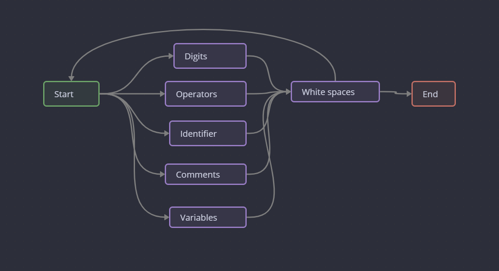

# Regex 

variables : `[a-z,A-Z_] ([0-9] | [a-z,A-Z_])\* | whitespace | end`
digits: `([0-9] | operators) ([0-9])\* | end`
identifiers: `bool | break | char | continue | else | false | for | if | int | print | return | true | and | or | not | whitespace | end`
comments:` //  |  /\* /w \*/ | whitespace | end`
whitespace: `space | tab | \n`
operators: `+ | - | * | / | % | > | < | = | <= | >= | != | == |  (  |  ) | [ | ] | { | } | ; | , | && | || | whitespace | end`
end: `\0`

# ماشین گذار

