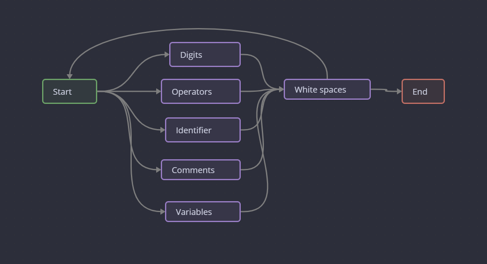

اعضای گروه: سپهر شیرازی، سهیل سلیمی
# فاز ۱ 

variables : `[a-z,A-Z_] ([0-9] | [a-z,A-Z_])\* | whitespace | end`
digits: `([0-9] | operators) ([0-9])\* | end`
identifiers: `bool | break | char | continue | else | false | for | if | int | print | return | true | and | or | not | whitespace | end`
comments:` //  |  /\* /w \*/ | whitespace | end`
whitespace: `space | tab | \n`
operators: `+ | - | * | / | % | > | < | = | <= | >= | != | == |  (  |  ) | [ | ] | { | } | ; | , | && | || | whitespace | end`
end: `\0`

# ماشین گذار



-------------------------------
فاز ۲
-------------------------------

# Grammar 

```
Program -> Declarations
Declarations -> Declaration Declarations
Declarations -> ''
Declaration -> Type VarOrFunc
VarOrFunc -> Identifier VarOrFuncRest
VarOrFuncRest -> FunctionRest
VarOrFuncRest -> VarDeclRest
VarDeclRest -> Initialization MoreIdentifiers T_Semicolon
FunctionRest -> T_LP Parameters T_RP Block
Type -> T_Int
Type -> T_Bool
Type -> T_Char
MoreIdentifiers -> T_Comma Identifier Initialization MoreIdentifiers
MoreIdentifiers -> ''
Initialization -> T_Assign Expression
Initialization -> T_LB IntegerLiteral T_RB Initialization
Initialization -> ''
Functions -> Function Functions 
Functions -> ''
Function -> Type Identifier FunctionRest
Parameters -> ParameterList
Parameters -> ''
ParameterList -> Parameter MoreParameters
Parameter -> Type Identifier
MoreParameters -> T_Comma Parameter MoreParameters
MoreParameters -> ''
Block -> T_LC Statements T_RC
Statements -> Statement Statements
Statements -> ''
Statement -> Declaration
Statement -> Assignment T_Semicolon
Statement -> IfStatement
Statement -> ForStatement
Statement -> PrintStatement T_Semicolon
Statement -> ReturnStatement T_Semicolon
Statement -> BreakStatement T_Semicolon
Statement -> ContinueStatement T_Semicolon
Assignment -> Identifier T_Assign Expression
IfStatement -> T_If T_LP Expression T_RP Block ElseIfs ElseBlock
ElseIfs -> ElseIf ElseIfs
ElseIfs -> ''
ElseIf -> T_Else T_If T_LP Expression T_RP Block
ElseBlock -> T_Else Block
ElseBlock -> ''
ForStatement -> T_For T_LP ForInit ForCondition T_Semicolon ForUpdate T_RP Block
ForInit -> Assignment
ForInit -> Declaration
ForInit -> ''
ForCondition -> Expression
ForCondition -> ''
ForUpdate -> Assignment
ForUpdate -> ''
PrintStatement -> T_Print T_LP PrintArguments T_RP
PrintArguments -> StringLiteral MorePrintArguments
PrintArguments -> Expression
MorePrintArguments -> T_Comma Expression MorePrintArguments
MorePrintArguments -> ''
ReturnStatement -> T_Return Expression
BreakStatement -> T_Break
ContinueStatement -> T_Continue
Expression -> LogicalOr
LogicalOr -> LogicalAnd LogicalOrPRE
LogicalOrPRE  -> T_LOp_OR LogicalAnd LogicalOrPRE
LogicalOrPRE  -> ''
LogicalAnd -> Equality LogicalAndPRE
LogicalAndPRE  -> T_LOp_AND Equality LogicalAndPRE
LogicalAndPRE  -> ''
Equality -> Relational EqualityPRE
EqualityPRE ->  T_ROp_E Relational EqualityPRE
EqualityPRE  -> T_ROp_NE Relational EqualityPRE
EqualityPRE  -> ''
Relational -> Additive RelationalPRE
RelationalPRE ->  T_ROp_L Additive RelationalPRE
RelationalPRE ->  T_ROp_LE Additive RelationalPRE
RelationalPRE ->  T_ROp_G Additive RelationalPRE
RelationalPRE ->  T_ROp_GE Additive RelationalPRE
RelationalPRE ->  ''
Additive -> Multiplicative AdditivePRE
AdditivePRE  -> T_AOp_PL Multiplicative AdditivePRE
AdditivePRE  -> T_AOp_MN Multiplicative AdditivePRE
AdditivePRE  -> ''
Multiplicative -> Unary MultiplicativePRE
MultiplicativePRE ->  T_AOp_ML Unary MultiplicativePRE
MultiplicativePRE ->  T_AOp_DV Unary MultiplicativePRE
MultiplicativePRE ->  T_AOp_RM Unary MultiplicativePRE
MultiplicativePRE ->  ''
Unary -> T_LOp_NOT Unary
Unary -> Primary
Primary -> Identifier
Primary -> IntegerLiteral
Primary -> BooleanLiteral
Primary -> CharacterLiteral
Primary -> StringLiteral
Primary -> T_LP Expression T_RP
Identifier -> T_Id
IntegerLiteral -> T_Decimal
IntegerLiteral -> T_Hexadecimal
BooleanLiteral -> T_True
BooleanLiteral -> T_False
CharacterLiteral -> T_Character
StringLiteral -> T_String
```
- **Program**: نقطه شروع گرامر است و به معنای کل برنامه است. این قاعده به `Declarations` اشاره دارد که می‌تواند شامل یک یا چند `Declaration` باشد.

- **Declarations**: مجموعه‌ای از تعاریف است که می‌تواند شامل متغیرها، توابع و سایر اعلان‌ها باشد.

- **Declaration**: یک تعریف خاص است که می‌تواند یک `Type` و `VarOrFunc` باشد. `Type` می‌تواند `T_Int`, `T_Bool`, یا `T_Char` باشد.

- **VarOrFunc**: تعیین می‌کند که آیا `Declaration` به یک متغیر یا تابع اشاره دارد.

- **FunctionRest** و **VarDeclRest**: تعیین می‌کنند که تعریف به یک تابع با پارامترها و بلاک کد یا یک اعلان متغیر با مقداردهی اولیه و سایر شناسه‌ها اشاره دارد.

- **Block**: بلاک کد است که می‌تواند شامل چندین `Statement` باشد.

- **Statement**: یک عملیات خاص در برنامه است که می‌تواند شامل اعلان‌ها، اختصاص‌ها، شرط‌ها، حلقه‌ها و غیره باشد.

و غیره

# first and follow and predict table
ما از سایت [hackingoff](http://hackingoff.com/compilers/predict-first-follow-set) برای تبدیل استفاده کردیم

## first

| Non-Terminal&nbsp;Symbol | First Set                                                       |
|--------------------------|-----------------------------------------------------------------|
| ε                        | ε                                                               |
| ;                        | ;                                                               |
| (                        | (                                                               |
| )                        | )                                                               |
| int                      | int                                                             |
| bool                     | bool                                                            |
| char                     | char                                                            |
| ,                        | ,                                                               |
| =                        | =                                                               |
| [                        | [                                                               |
| ]                        | ]                                                               |
| {                        | {                                                               |
| }                        | }                                                               |
| if                       | if                                                              |
| else                     | else                                                            |
| for                      | for                                                             |
| print                    | print                                                           |
| return                   | return                                                          |
| break                    | break                                                           |
| continue                 | continue                                                        |
| &amp;                    | &amp;                                                           |
| !                        | !                                                               |
| &lt;                     | &lt;                                                            |
| &gt;                     | &gt;                                                            |
| +                        | +                                                               |
| -                        | -                                                               |
| *                        | *                                                               |
| /                        | /                                                               |
| %                        | %                                                               |
| id                       | id                                                              |
| number                   | number                                                          |
| true                     | true                                                            |
| false                    | false                                                           |
| character                | character                                                       |
| string                   | string                                                          |
| Declarations             | ε, int, bool, char                                              |
| VarDeclRest              | ;, =, [, ε, ,                                                   |
| FunctionRest             | (                                                               |
| Type                     | int, bool, char                                                 |
| MoreIdentifiers          | ,, ε                                                            |
| Initialization           | =, [, ε                                                         |
| Functions                | ε, int, bool, char                                              |
| Parameters               | ε, int, bool, char                                              |
| MoreParameters           | ,, ε                                                            |
| Block                    | {                                                               |
| Statements               | ε, int, bool, char, if, print, break, id, return, for, continue |
| IfStatement              | if                                                              |
| ElseIfs                  | ε, else                                                         |
| ElseIf                   | else                                                            |
| ElseBlock                | else, ε                                                         |
| ForStatement             | for                                                             |
| ForInit                  | ε, id, int, bool, char                                          |
| ForCondition             | ε, !, (, id, true, false, string, number, character             |
| ForUpdate                | ε, id                                                           |
| PrintStatement           | print                                                           |
| MorePrintArguments       | ,, ε                                                            |
| ReturnStatement          | return                                                          |
| BreakStatement           | break                                                           |
| ContinueStatement        | continue                                                        |
| LogicalOrPRE             | ε, !, (, id, true, false, string, number, character             |
| LogicalAndPRE            | &amp;, ε                                                        |
| EqualityPRE              | =, !, ε                                                         |
| RelationalPRE            | &lt;, &gt;, ε                                                   |
| AdditivePRE              | +, -, ε                                                         |
| MultiplicativePRE        | *, /, %, ε                                                      |
| Unary                    | !, (, id, true, false, string, number, character                |
| Primary                  | (, id, true, false, string, number, character                   |
| Identifier               | id                                                              |
| IntegerLiteral           | number                                                          |
| BooleanLiteral           | true, false                                                     |
| CharacterLiteral         | character                                                       |
| StringLiteral            | string                                                          |
| Declaration              | int, bool, char                                                 |
| VarOrFunc                | id                                                              |
| VarOrFuncRest            | (, ;, =, [, ε, ,                                                |
| Function                 | int, bool, char                                                 |
| Parameter                | int, bool, char                                                 |
| Assignment               | id                                                              |
| PrintArguments           | string                                                          |
| ParameterList            | int, bool, char                                                 |
| Statement                | int, bool, char, if, print, break, id, return, for, continue    |
| Program                  | ε, int, bool, char                                              |
| Multiplicative           | !, (, id, true, false, string, number, character                |
| Additive                 | !, (, id, true, false, string, number, character                |
| Relational               | !, (, id, true, false, string, number, character                |
| Equality                 | !, (, id, true, false, string, number, character                |
| LogicalAnd               | !, (, id, true, false, string, number, character                |
| LogicalOr                | !, (, id, true, false, string, number, character                |
| Expression               | !, (, id, true, false, string, number, character                |

## follow
| Non-Terminal&nbsp;Symbol | Follow Set                                                                                                                |
|--------------------------|---------------------------------------------------------------------------------------------------------------------------|
| Program                  | $                                                                                                                         |
| Declarations             | $                                                                                                                         |
| Declaration              | int, bool, char, ;, if, print, break, id, return, for, continue, $, }                                                     |
| VarOrFunc                | int, bool, char, ;, if, print, break, id, return, for, continue, $, }                                                     |
| VarOrFuncRest            | int, bool, char, ;, if, print, break, id, return, for, continue, $, }                                                     |
| VarDeclRest              | int, bool, char, ;, if, print, break, id, return, for, continue, $, }                                                     |
| FunctionRest             | int, bool, char, ;, if, print, break, id, return, for, continue, $, }                                                     |
| Type                     | id                                                                                                                        |
| MoreIdentifiers          | ;                                                                                                                         |
| Initialization           | ,, ;                                                                                                                      |
| Functions                |                                                                                                                           |
| Function                 | int, bool, char                                                                                                           |
| Parameters               | )                                                                                                                         |
| ParameterList            | )                                                                                                                         |
| Parameter                | ,, )                                                                                                                      |
| MoreParameters           | )                                                                                                                         |
| Block                    | !, (, id, true, false, string, number, character, else, int, bool, char, ;, if, print, break, return, for, continue, $, } |
| Statements               | }                                                                                                                         |
| Statement                | int, bool, char, if, print, break, id, return, for, continue, }                                                           |
| Assignment               | ;, )                                                                                                                      |
| IfStatement              | int, bool, char, if, print, break, id, return, for, continue, }                                                           |
| ElseIfs                  | else, int, bool, char, if, print, break, id, return, for, continue, }                                                     |
| ElseIf                   | else, int, bool, char, if, print, break, id, return, for, continue, }                                                     |
| ElseBlock                | int, bool, char, if, print, break, id, return, for, continue, }                                                           |
| ForStatement             | int, bool, char, if, print, break, id, return, for, continue, }                                                           |
| ForInit                  | ;                                                                                                                         |
| ForCondition             | ;                                                                                                                         |
| ForUpdate                | )                                                                                                                         |
| PrintStatement           | ;                                                                                                                         |
| PrintArguments           | )                                                                                                                         |
| MorePrintArguments       | )                                                                                                                         |
| ReturnStatement          | ;                                                                                                                         |
| BreakStatement           | ;                                                                                                                         |
| ContinueStatement        | ;                                                                                                                         |
| Expression               | ), ,, ;                                                                                                                   |
| LogicalOr                | ), ,, ;                                                                                                                   |
| LogicalOrPRE             | ), ,, ;                                                                                                                   |
| LogicalAnd               | !, (, id, true, false, string, number, character, ), ,, ;                                                                 |
| LogicalAndPRE            | !, (, id, true, false, string, number, character, ), ,, ;                                                                 |
| Equality                 | &amp;, !, (, id, true, false, string, number, character, ), ,, ;                                                          |
| EqualityPRE              | &amp;, !, (, id, true, false, string, number, character, ), ,, ;                                                          |
| Relational               | =, !, &amp;, (, id, true, false, string, number, character, ), ,, ;                                                       |
| RelationalPRE            | =, !, &amp;, (, id, true, false, string, number, character, ), ,, ;                                                       |
| Additive                 | &lt;, &gt;, =, !, &amp;, (, id, true, false, string, number, character, ), ,, ;                                           |
| AdditivePRE              | &lt;, &gt;, =, !, &amp;, (, id, true, false, string, number, character, ), ,, ;                                           |
| Multiplicative           | +, -, &lt;, &gt;, =, !, &amp;, (, id, true, false, string, number, character, ), ,, ;                                     |
| MultiplicativePRE        | +, -, &lt;, &gt;, =, !, &amp;, (, id, true, false, string, number, character, ), ,, ;                                     |
| Unary                    | *, /, %, +, -, &lt;, &gt;, =, !, &amp;, (, id, true, false, string, number, character, ), ,, ;                            |
| Primary                  | *, /, %, +, -, &lt;, &gt;, =, !, &amp;, (, id, true, false, string, number, character, ), ,, ;                            |
| Identifier               | =, (, [, ;, ,, *, /, %, +, -, &lt;, &gt;, !, &amp;, id, true, false, string, number, character, )                         |
| IntegerLiteral           | ], *, /, %, +, -, &lt;, &gt;, =, !, &amp;, (, id, true, false, string, number, character, ), ,, ;                         |
| BooleanLiteral           | *, /, %, +, -, &lt;, &gt;, =, !, &amp;, (, id, true, false, string, number, character, ), ,, ;                            |
| CharacterLiteral         | *, /, %, +, -, &lt;, &gt;, =, !, &amp;, (, id, true, false, string, number, character, ), ,, ;                            |
| StringLiteral            | ,, *, /, %, +, -, &lt;, &gt;, =, !, &amp;, (, id, true, false, string, number, character, ), ;                            |

## predict table
 **Nonterminal** | **T\_Semicolon** | **T\_LP** | **T\_RP** | **T\_Int** | **T\_Bool** | **T\_Char** | **T\_Comma** | **T\_Assign** | **T\_LB** | **T\_RB** | **T\_LC** | **T\_RC** | **T\_If** | **T\_Else** | **T\_For** | **T\_Print** | **T\_Return** | **T\_Break** | **T\_Continue** | **T\_LOp\_OR** | **T\_LOp\_AND** | **T\_ROp\_E** | **T\_ROp\_NE** | **T\_ROp\_L** | **T\_ROp\_LE** | **T\_ROp\_G** | **T\_ROp\_GE** | **T\_AOp\_PL** | **T\_AOp\_MN** | **T\_AOp\_ML** | **T\_AOp\_DV** | **T\_AOp\_RM** | **T\_LOp\_NOT** | **T\_Id** | **T\_Decimal** | **T\_Hexadecimal** | **T\_True** | **T\_False** | **T\_Character** | **T\_String** | **$** 
---|---|---|---|---|---|---|---|---|---|---|---|---|---|---|---|---|---|---|---|---|---|---|---|---|---|---|---|---|---|---|---|---|---|---|---|---|---|---|---|---|---
 **Program** |  |  |  | Program \-&gt; Declarations | Program \-&gt; Declarations | Program \-&gt; Declarations |  |  |  |  |  |  |  |  |  |  |  |  |  |  |  |  |  |  |  |  |  |  |  |  |  |  |  |  |  |  |  |  |  |  | Program \-&gt; Declarations 
 **Declarations** |  |  |  | Declarations \-&gt; Declaration Declarations | Declarations \-&gt; Declaration Declarations | Declarations \-&gt; Declaration Declarations |  |  |  |  |  |  |  |  |  |  |  |  |  |  |  |  |  |  |  |  |  |  |  |  |  |  |  |  |  |  |  |  |  |  | Declarations \-&gt; '' 
 **Declaration** |  |  |  | Declaration \-&gt; Type VarOrFunc | Declaration \-&gt; Type VarOrFunc | Declaration \-&gt; Type VarOrFunc |  |  |  |  |  |  |  |  |  |  |  |  |  |  |  |  |  |  |  |  |  |  |  |  |  |  |  |  |  |  |  |  |  |  |  
 **VarOrFunc** |  |  |  |  |  |  |  |  |  |  |  |  |  |  |  |  |  |  |  |  |  |  |  |  |  |  |  |  |  |  |  |  |  | VarOrFunc \-&gt; Identifier VarOrFuncRest |  |  |  |  |  |  |  
 **VarOrFuncRest** | VarOrFuncRest \-&gt; VarDeclRestVarOrFuncRest \-&gt; VarDeclRest | VarOrFuncRest \-&gt; FunctionRestVarOrFuncRest \-&gt; VarDeclRest |  | VarOrFuncRest \-&gt; VarDeclRest | VarOrFuncRest \-&gt; VarDeclRest | VarOrFuncRest \-&gt; VarDeclRest | VarOrFuncRest \-&gt; VarDeclRest | VarOrFuncRest \-&gt; VarDeclRest | VarOrFuncRest \-&gt; VarDeclRest |  |  | VarOrFuncRest \-&gt; VarDeclRest | VarOrFuncRest \-&gt; VarDeclRest |  | VarOrFuncRest \-&gt; VarDeclRest | VarOrFuncRest \-&gt; VarDeclRest | VarOrFuncRest \-&gt; VarDeclRest | VarOrFuncRest \-&gt; VarDeclRest | VarOrFuncRest \-&gt; VarDeclRest |  |  |  |  |  |  |  |  |  |  |  |  |  | VarOrFuncRest \-&gt; VarDeclRest | VarOrFuncRest \-&gt; VarDeclRest | VarOrFuncRest \-&gt; VarDeclRest | VarOrFuncRest \-&gt; VarDeclRest | VarOrFuncRest \-&gt; VarDeclRest | VarOrFuncRest \-&gt; VarDeclRest | VarOrFuncRest \-&gt; VarDeclRest | VarOrFuncRest \-&gt; VarDeclRest | VarOrFuncRest \-&gt; VarDeclRest 
 **VarDeclRest** | VarDeclRest \-&gt; Initialization MoreIdentifiers T\_SemicolonVarDeclRest \-&gt; Initialization MoreIdentifiers T\_Semicolon | VarDeclRest \-&gt; Initialization MoreIdentifiers T\_Semicolon |  | VarDeclRest \-&gt; Initialization MoreIdentifiers T\_Semicolon | VarDeclRest \-&gt; Initialization MoreIdentifiers T\_Semicolon | VarDeclRest \-&gt; Initialization MoreIdentifiers T\_Semicolon | VarDeclRest \-&gt; Initialization MoreIdentifiers T\_Semicolon | VarDeclRest \-&gt; Initialization MoreIdentifiers T\_Semicolon | VarDeclRest \-&gt; Initialization MoreIdentifiers T\_Semicolon |  |  | VarDeclRest \-&gt; Initialization MoreIdentifiers T\_Semicolon | VarDeclRest \-&gt; Initialization MoreIdentifiers T\_Semicolon |  | VarDeclRest \-&gt; Initialization MoreIdentifiers T\_Semicolon | VarDeclRest \-&gt; Initialization MoreIdentifiers T\_Semicolon | VarDeclRest \-&gt; Initialization MoreIdentifiers T\_Semicolon | VarDeclRest \-&gt; Initialization MoreIdentifiers T\_Semicolon | VarDeclRest \-&gt; Initialization MoreIdentifiers T\_Semicolon |  |  |  |  |  |  |  |  |  |  |  |  |  | VarDeclRest \-&gt; Initialization MoreIdentifiers T\_Semicolon | VarDeclRest \-&gt; Initialization MoreIdentifiers T\_Semicolon | VarDeclRest \-&gt; Initialization MoreIdentifiers T\_Semicolon | VarDeclRest \-&gt; Initialization MoreIdentifiers T\_Semicolon | VarDeclRest \-&gt; Initialization MoreIdentifiers T\_Semicolon | VarDeclRest \-&gt; Initialization MoreIdentifiers T\_Semicolon | VarDeclRest \-&gt; Initialization MoreIdentifiers T\_Semicolon | VarDeclRest \-&gt; Initialization MoreIdentifiers T\_Semicolon | VarDeclRest \-&gt; Initialization MoreIdentifiers T\_Semicolon 
 **FunctionRest** |  | FunctionRest \-&gt; T\_LP Parameters T\_RP Block |  |  |  |  |  |  |  |  |  |  |  |  |  |  |  |  |  |  |  |  |  |  |  |  |  |  |  |  |  |  |  |  |  |  |  |  |  |  |  
 **Type** |  |  |  | Type \-&gt; T\_Int | Type \-&gt; T\_Bool | Type \-&gt; T\_Char |  |  |  |  |  |  |  |  |  |  |  |  |  |  |  |  |  |  |  |  |  |  |  |  |  |  |  |  |  |  |  |  |  |  |  
 **MoreIdentifiers** | MoreIdentifiers \-&gt; '' |  |  |  |  |  | MoreIdentifiers \-&gt; T\_Comma Identifier Initialization MoreIdentifiers |  |  |  |  |  |  |  |  |  |  |  |  |  |  |  |  |  |  |  |  |  |  |  |  |  |  |  |  |  |  |  |  |  |  
 **Initialization** | Initialization \-&gt; '' | Initialization \-&gt; '' |  | Initialization \-&gt; '' | Initialization \-&gt; '' | Initialization \-&gt; '' | Initialization \-&gt; '' | Initialization \-&gt; T\_Assign Expression | Initialization \-&gt; T\_LB IntegerLiteral T\_RB Initialization |  |  | Initialization \-&gt; '' | Initialization \-&gt; '' |  | Initialization \-&gt; '' | Initialization \-&gt; '' | Initialization \-&gt; '' | Initialization \-&gt; '' | Initialization \-&gt; '' |  |  |  |  |  |  |  |  |  |  |  |  |  | Initialization \-&gt; '' | Initialization \-&gt; '' | Initialization \-&gt; '' | Initialization \-&gt; '' | Initialization \-&gt; '' | Initialization \-&gt; '' | Initialization \-&gt; '' | Initialization \-&gt; '' | Initialization \-&gt; '' 
 **Functions** |  |  |  | Functions \-&gt; Function Functions | Functions \-&gt; Function Functions | Functions \-&gt; Function Functions |  |  |  |  |  |  |  |  |  |  |  |  |  |  |  |  |  |  |  |  |  |  |  |  |  |  |  |  |  |  |  |  |  |  |  
 **Function** |  |  |  | Function \-&gt; Type Identifier FunctionRest | Function \-&gt; Type Identifier FunctionRest | Function \-&gt; Type Identifier FunctionRest |  |  |  |  |  |  |  |  |  |  |  |  |  |  |  |  |  |  |  |  |  |  |  |  |  |  |  |  |  |  |  |  |  |  |  
 **Parameters** |  |  | Parameters \-&gt; '' | Parameters \-&gt; ParameterList | Parameters \-&gt; ParameterList | Parameters \-&gt; ParameterList |  |  |  |  |  |  |  |  |  |  |  |  |  |  |  |  |  |  |  |  |  |  |  |  |  |  |  |  |  |  |  |  |  |  |  
 **ParameterList** |  |  |  | ParameterList \-&gt; Parameter MoreParameters | ParameterList \-&gt; Parameter MoreParameters | ParameterList \-&gt; Parameter MoreParameters |  |  |  |  |  |  |  |  |  |  |  |  |  |  |  |  |  |  |  |  |  |  |  |  |  |  |  |  |  |  |  |  |  |  |  
 **Parameter** |  |  |  | Parameter \-&gt; Type Identifier | Parameter \-&gt; Type Identifier | Parameter \-&gt; Type Identifier |  |  |  |  |  |  |  |  |  |  |  |  |  |  |  |  |  |  |  |  |  |  |  |  |  |  |  |  |  |  |  |  |  |  |  
 **MoreParameters** |  |  | MoreParameters \-&gt; '' |  |  |  | MoreParameters \-&gt; T\_Comma Parameter MoreParameters |  |  |  |  |  |  |  |  |  |  |  |  |  |  |  |  |  |  |  |  |  |  |  |  |  |  |  |  |  |  |  |  |  |  
 **Block** |  |  |  |  |  |  |  |  |  |  | Block \-&gt; T\_LC Statements T\_RC |  |  |  |  |  |  |  |  |  |  |  |  |  |  |  |  |  |  |  |  |  |  |  |  |  |  |  |  |  |  
 **Statements** |  |  |  | Statements \-&gt; Statement Statements | Statements \-&gt; Statement Statements | Statements \-&gt; Statement Statements |  |  |  |  |  | Statements \-&gt; '' | Statements \-&gt; Statement Statements |  | Statements \-&gt; Statement Statements | Statements \-&gt; Statement Statements | Statements \-&gt; Statement Statements | Statements \-&gt; Statement Statements | Statements \-&gt; Statement Statements |  |  |  |  |  |  |  |  |  |  |  |  |  |  | Statements \-&gt; Statement Statements |  |  |  |  |  |  |  
 **Statement** |  |  |  | Statement \-&gt; Declaration | Statement \-&gt; Declaration | Statement \-&gt; Declaration |  |  |  |  |  |  | Statement \-&gt; IfStatement |  | Statement \-&gt; ForStatement | Statement \-&gt; PrintStatement T\_Semicolon | Statement \-&gt; ReturnStatement T\_Semicolon | Statement \-&gt; BreakStatement T\_Semicolon | Statement \-&gt; ContinueStatement T\_Semicolon |  |  |  |  |  |  |  |  |  |  |  |  |  |  | Statement \-&gt; Assignment T\_Semicolon |  |  |  |  |  |  |  
 **Assignment** |  |  |  |  |  |  |  |  |  |  |  |  |  |  |  |  |  |  |  |  |  |  |  |  |  |  |  |  |  |  |  |  |  | Assignment \-&gt; Identifier T\_Assign Expression |  |  |  |  |  |  |  
 **IfStatement** |  |  |  |  |  |  |  |  |  |  |  |  | IfStatement \-&gt; T\_If T\_LP Expression T\_RP Block ElseIfs ElseBlock |  |  |  |  |  |  |  |  |  |  |  |  |  |  |  |  |  |  |  |  |  |  |  |  |  |  |  |  
 **ElseIfs** |  |  |  | ElseIfs \-&gt; '' | ElseIfs \-&gt; '' | ElseIfs \-&gt; '' |  |  |  |  |  | ElseIfs \-&gt; '' | ElseIfs \-&gt; '' | ElseIfs \-&gt; ElseIf ElseIfsElseIfs \-&gt; '' | ElseIfs \-&gt; '' | ElseIfs \-&gt; '' | ElseIfs \-&gt; '' | ElseIfs \-&gt; '' | ElseIfs \-&gt; '' |  |  |  |  |  |  |  |  |  |  |  |  |  |  | ElseIfs \-&gt; '' |  |  |  |  |  |  |  
 **ElseIf** |  |  |  |  |  |  |  |  |  |  |  |  |  | ElseIf \-&gt; T\_Else T\_If T\_LP Expression T\_RP Block |  |  |  |  |  |  |  |  |  |  |  |  |  |  |  |  |  |  |  |  |  |  |  |  |  |  |  
 **ElseBlock** |  |  |  | ElseBlock \-&gt; '' | ElseBlock \-&gt; '' | ElseBlock \-&gt; '' |  |  |  |  |  | ElseBlock \-&gt; '' | ElseBlock \-&gt; '' | ElseBlock \-&gt; T\_Else Block | ElseBlock \-&gt; '' | ElseBlock \-&gt; '' | ElseBlock \-&gt; '' | ElseBlock \-&gt; '' | ElseBlock \-&gt; '' |  |  |  |  |  |  |  |  |  |  |  |  |  |  | ElseBlock \-&gt; '' |  |  |  |  |  |  |  
 **ForStatement** |  |  |  |  |  |  |  |  |  |  |  |  |  |  | ForStatement \-&gt; T\_For T\_LP ForInit ForCondition T\_Semicolon ForUpdate T\_RP Block |  |  |  |  |  |  |  |  |  |  |  |  |  |  |  |  |  |  |  |  |  |  |  |  |  |  
 **ForInit** | ForInit \-&gt; '' | ForInit \-&gt; '' |  | ForInit \-&gt; DeclarationForInit \-&gt; '' | ForInit \-&gt; DeclarationForInit \-&gt; '' | ForInit \-&gt; DeclarationForInit \-&gt; '' |  |  |  |  |  | ForInit \-&gt; '' | ForInit \-&gt; '' |  | ForInit \-&gt; '' | ForInit \-&gt; '' | ForInit \-&gt; '' | ForInit \-&gt; '' | ForInit \-&gt; '' |  |  |  |  |  |  |  |  |  |  |  |  |  | ForInit \-&gt; '' | ForInit \-&gt; AssignmentForInit \-&gt; '' | ForInit \-&gt; '' | ForInit \-&gt; '' | ForInit \-&gt; '' | ForInit \-&gt; '' | ForInit \-&gt; '' | ForInit \-&gt; '' |  
 **ForCondition** | ForCondition \-&gt; '' | ForCondition \-&gt; Expression |  |  |  |  |  |  |  |  |  |  |  |  |  |  |  |  |  |  |  |  |  |  |  |  |  |  |  |  |  |  | ForCondition \-&gt; Expression | ForCondition \-&gt; Expression | ForCondition \-&gt; Expression | ForCondition \-&gt; Expression | ForCondition \-&gt; Expression | ForCondition \-&gt; Expression | ForCondition \-&gt; Expression | ForCondition \-&gt; Expression |  
 **ForUpdate** |  |  | ForUpdate \-&gt; '' |  |  |  |  |  |  |  |  |  |  |  |  |  |  |  |  |  |  |  |  |  |  |  |  |  |  |  |  |  |  | ForUpdate \-&gt; Assignment |  |  |  |  |  |  |  
 **PrintStatement** |  |  |  |  |  |  |  |  |  |  |  |  |  |  |  | PrintStatement \-&gt; T\_Print T\_LP PrintArguments T\_RP |  |  |  |  |  |  |  |  |  |  |  |  |  |  |  |  |  |  |  |  |  |  |  |  |  
 **PrintArguments** |  | PrintArguments \-&gt; Expression |  |  |  |  |  |  |  |  |  |  |  |  |  |  |  |  |  |  |  |  |  |  |  |  |  |  |  |  |  |  | PrintArguments \-&gt; Expression | PrintArguments \-&gt; Expression | PrintArguments \-&gt; Expression | PrintArguments \-&gt; Expression | PrintArguments \-&gt; Expression | PrintArguments \-&gt; Expression | PrintArguments \-&gt; Expression | PrintArguments \-&gt; StringLiteral MorePrintArgumentsPrintArguments \-&gt; Expression |  
 **MorePrintArguments** |  |  | MorePrintArguments \-&gt; '' |  |  |  | MorePrintArguments \-&gt; T\_Comma Expression MorePrintArguments |  |  |  |  |  |  |  |  |  |  |  |  |  |  |  |  |  |  |  |  |  |  |  |  |  |  |  |  |  |  |  |  |  |  
 **ReturnStatement** |  |  |  |  |  |  |  |  |  |  |  |  |  |  |  |  | ReturnStatement \-&gt; T\_Return Expression |  |  |  |  |  |  |  |  |  |  |  |  |  |  |  |  |  |  |  |  |  |  |  |  
 **BreakStatement** |  |  |  |  |  |  |  |  |  |  |  |  |  |  |  |  |  | BreakStatement \-&gt; T\_Break |  |  |  |  |  |  |  |  |  |  |  |  |  |  |  |  |  |  |  |  |  |  |  
 **ContinueStatement** |  |  |  |  |  |  |  |  |  |  |  |  |  |  |  |  |  |  | ContinueStatement \-&gt; T\_Continue |  |  |  |  |  |  |  |  |  |  |  |  |  |  |  |  |  |  |  |  |  |  
 **Expression** |  | Expression \-&gt; LogicalOr |  |  |  |  |  |  |  |  |  |  |  |  |  |  |  |  |  |  |  |  |  |  |  |  |  |  |  |  |  |  | Expression \-&gt; LogicalOr | Expression \-&gt; LogicalOr | Expression \-&gt; LogicalOr | Expression \-&gt; LogicalOr | Expression \-&gt; LogicalOr | Expression \-&gt; LogicalOr | Expression \-&gt; LogicalOr | Expression \-&gt; LogicalOr |  
 **LogicalOr** |  | LogicalOr \-&gt; LogicalAnd LogicalOrPRE |  |  |  |  |  |  |  |  |  |  |  |  |  |  |  |  |  |  |  |  |  |  |  |  |  |  |  |  |  |  | LogicalOr \-&gt; LogicalAnd LogicalOrPRE | LogicalOr \-&gt; LogicalAnd LogicalOrPRE | LogicalOr \-&gt; LogicalAnd LogicalOrPRE | LogicalOr \-&gt; LogicalAnd LogicalOrPRE | LogicalOr \-&gt; LogicalAnd LogicalOrPRE | LogicalOr \-&gt; LogicalAnd LogicalOrPRE | LogicalOr \-&gt; LogicalAnd LogicalOrPRE | LogicalOr \-&gt; LogicalAnd LogicalOrPRE |  
 **LogicalOrPRE** | LogicalOrPRE  \-&gt; '' | LogicalOrPRE  \-&gt; '' | LogicalOrPRE  \-&gt; '' | LogicalOrPRE  \-&gt; '' | LogicalOrPRE  \-&gt; '' | LogicalOrPRE  \-&gt; '' | LogicalOrPRE  \-&gt; '' |  |  |  |  | LogicalOrPRE  \-&gt; '' | LogicalOrPRE  \-&gt; '' |  | LogicalOrPRE  \-&gt; '' | LogicalOrPRE  \-&gt; '' | LogicalOrPRE  \-&gt; '' | LogicalOrPRE  \-&gt; '' | LogicalOrPRE  \-&gt; '' | LogicalOrPRE  \-&gt; T\_LOp\_OR LogicalAnd LogicalOrPRE |  |  |  |  |  |  |  |  |  |  |  |  | LogicalOrPRE  \-&gt; '' | LogicalOrPRE  \-&gt; '' | LogicalOrPRE  \-&gt; '' | LogicalOrPRE  \-&gt; '' | LogicalOrPRE  \-&gt; '' | LogicalOrPRE  \-&gt; '' | LogicalOrPRE  \-&gt; '' | LogicalOrPRE  \-&gt; '' | LogicalOrPRE  \-&gt; '' 
 **LogicalAnd** |  | LogicalAnd \-&gt; Equality LogicalAndPRE |  |  |  |  |  |  |  |  |  |  |  |  |  |  |  |  |  |  |  |  |  |  |  |  |  |  |  |  |  |  | LogicalAnd \-&gt; Equality LogicalAndPRE | LogicalAnd \-&gt; Equality LogicalAndPRE | LogicalAnd \-&gt; Equality LogicalAndPRE | LogicalAnd \-&gt; Equality LogicalAndPRE | LogicalAnd \-&gt; Equality LogicalAndPRE | LogicalAnd \-&gt; Equality LogicalAndPRE | LogicalAnd \-&gt; Equality LogicalAndPRE | LogicalAnd \-&gt; Equality LogicalAndPRE |  
 **LogicalAndPRE** | LogicalAndPRE  \-&gt; '' | LogicalAndPRE  \-&gt; '' | LogicalAndPRE  \-&gt; '' | LogicalAndPRE  \-&gt; '' | LogicalAndPRE  \-&gt; '' | LogicalAndPRE  \-&gt; '' | LogicalAndPRE  \-&gt; '' |  |  |  |  | LogicalAndPRE  \-&gt; '' | LogicalAndPRE  \-&gt; '' |  | LogicalAndPRE  \-&gt; '' | LogicalAndPRE  \-&gt; '' | LogicalAndPRE  \-&gt; '' | LogicalAndPRE  \-&gt; '' | LogicalAndPRE  \-&gt; '' | LogicalAndPRE  \-&gt; '' | LogicalAndPRE  \-&gt; T\_LOp\_AND Equality LogicalAndPRE |  |  |  |  |  |  |  |  |  |  |  | LogicalAndPRE  \-&gt; '' | LogicalAndPRE  \-&gt; '' | LogicalAndPRE  \-&gt; '' | LogicalAndPRE  \-&gt; '' | LogicalAndPRE  \-&gt; '' | LogicalAndPRE  \-&gt; '' | LogicalAndPRE  \-&gt; '' | LogicalAndPRE  \-&gt; '' | LogicalAndPRE  \-&gt; '' 
 **Equality** |  | Equality \-&gt; Relational EqualityPRE |  |  |  |  |  |  |  |  |  |  |  |  |  |  |  |  |  |  |  |  |  |  |  |  |  |  |  |  |  |  | Equality \-&gt; Relational EqualityPRE | Equality \-&gt; Relational EqualityPRE | Equality \-&gt; Relational EqualityPRE | Equality \-&gt; Relational EqualityPRE | Equality \-&gt; Relational EqualityPRE | Equality \-&gt; Relational EqualityPRE | Equality \-&gt; Relational EqualityPRE | Equality \-&gt; Relational EqualityPRE |  
 **EqualityPRE** | EqualityPRE  \-&gt; '' | EqualityPRE  \-&gt; '' | EqualityPRE  \-&gt; '' | EqualityPRE  \-&gt; '' | EqualityPRE  \-&gt; '' | EqualityPRE  \-&gt; '' | EqualityPRE  \-&gt; '' |  |  |  |  | EqualityPRE  \-&gt; '' | EqualityPRE  \-&gt; '' |  | EqualityPRE  \-&gt; '' | EqualityPRE  \-&gt; '' | EqualityPRE  \-&gt; '' | EqualityPRE  \-&gt; '' | EqualityPRE  \-&gt; '' | EqualityPRE  \-&gt; '' | EqualityPRE  \-&gt; '' | EqualityPRE \-&gt;  T\_ROp\_E Relational EqualityPRE | EqualityPRE  \-&gt; T\_ROp\_NE Relational EqualityPRE |  |  |  |  |  |  |  |  |  | EqualityPRE  \-&gt; '' | EqualityPRE  \-&gt; '' | EqualityPRE  \-&gt; '' | EqualityPRE  \-&gt; '' | EqualityPRE  \-&gt; '' | EqualityPRE  \-&gt; '' | EqualityPRE  \-&gt; '' | EqualityPRE  \-&gt; '' | EqualityPRE  \-&gt; '' 
 **Relational** |  | Relational \-&gt; Additive RelationalPRE |  |  |  |  |  |  |  |  |  |  |  |  |  |  |  |  |  |  |  |  |  |  |  |  |  |  |  |  |  |  | Relational \-&gt; Additive RelationalPRE | Relational \-&gt; Additive RelationalPRE | Relational \-&gt; Additive RelationalPRE | Relational \-&gt; Additive RelationalPRE | Relational \-&gt; Additive RelationalPRE | Relational \-&gt; Additive RelationalPRE | Relational \-&gt; Additive RelationalPRE | Relational \-&gt; Additive RelationalPRE |  
 **RelationalPRE** | RelationalPRE \-&gt;  '' | RelationalPRE \-&gt;  '' | RelationalPRE \-&gt;  '' | RelationalPRE \-&gt;  '' | RelationalPRE \-&gt;  '' | RelationalPRE \-&gt;  '' | RelationalPRE \-&gt;  '' |  |  |  |  | RelationalPRE \-&gt;  '' | RelationalPRE \-&gt;  '' |  | RelationalPRE \-&gt;  '' | RelationalPRE \-&gt;  '' | RelationalPRE \-&gt;  '' | RelationalPRE \-&gt;  '' | RelationalPRE \-&gt;  '' | RelationalPRE \-&gt;  '' | RelationalPRE \-&gt;  '' | RelationalPRE \-&gt;  '' | RelationalPRE \-&gt;  '' | RelationalPRE \-&gt;  T\_ROp\_L Additive RelationalPRE | RelationalPRE \-&gt;  T\_ROp\_LE Additive RelationalPRE | RelationalPRE \-&gt;  T\_ROp\_G Additive RelationalPRE | RelationalPRE \-&gt;  T\_ROp\_GE Additive RelationalPRE |  |  |  |  |  | RelationalPRE \-&gt;  '' | RelationalPRE \-&gt;  '' | RelationalPRE \-&gt;  '' | RelationalPRE \-&gt;  '' | RelationalPRE \-&gt;  '' | RelationalPRE \-&gt;  '' | RelationalPRE \-&gt;  '' | RelationalPRE \-&gt;  '' | RelationalPRE \-&gt;  '' 
 **Additive** |  | Additive \-&gt; Multiplicative AdditivePRE |  |  |  |  |  |  |  |  |  |  |  |  |  |  |  |  |  |  |  |  |  |  |  |  |  |  |  |  |  |  | Additive \-&gt; Multiplicative AdditivePRE | Additive \-&gt; Multiplicative AdditivePRE | Additive \-&gt; Multiplicative AdditivePRE | Additive \-&gt; Multiplicative AdditivePRE | Additive \-&gt; Multiplicative AdditivePRE | Additive \-&gt; Multiplicative AdditivePRE | Additive \-&gt; Multiplicative AdditivePRE | Additive \-&gt; Multiplicative AdditivePRE |  
 **AdditivePRE** | AdditivePRE  \-&gt; '' | AdditivePRE  \-&gt; '' | AdditivePRE  \-&gt; '' | AdditivePRE  \-&gt; '' | AdditivePRE  \-&gt; '' | AdditivePRE  \-&gt; '' | AdditivePRE  \-&gt; '' |  |  |  |  | AdditivePRE  \-&gt; '' | AdditivePRE  \-&gt; '' |  | AdditivePRE  \-&gt; '' | AdditivePRE  \-&gt; '' | AdditivePRE  \-&gt; '' | AdditivePRE  \-&gt; '' | AdditivePRE  \-&gt; '' | AdditivePRE  \-&gt; '' | AdditivePRE  \-&gt; '' | AdditivePRE  \-&gt; '' | AdditivePRE  \-&gt; '' | AdditivePRE  \-&gt; '' | AdditivePRE  \-&gt; '' | AdditivePRE  \-&gt; '' | AdditivePRE  \-&gt; '' | AdditivePRE  \-&gt; T\_AOp\_PL Multiplicative AdditivePRE | AdditivePRE  \-&gt; T\_AOp\_MN Multiplicative AdditivePRE |  |  |  | AdditivePRE  \-&gt; '' | AdditivePRE  \-&gt; '' | AdditivePRE  \-&gt; '' | AdditivePRE  \-&gt; '' | AdditivePRE  \-&gt; '' | AdditivePRE  \-&gt; '' | AdditivePRE  \-&gt; '' | AdditivePRE  \-&gt; '' | AdditivePRE  \-&gt; '' 
 **Multiplicative** |  | Multiplicative \-&gt; Unary MultiplicativePRE |  |  |  |  |  |  |  |  |  |  |  |  |  |  |  |  |  |  |  |  |  |  |  |  |  |  |  |  |  |  | Multiplicative \-&gt; Unary MultiplicativePRE | Multiplicative \-&gt; Unary MultiplicativePRE | Multiplicative \-&gt; Unary MultiplicativePRE | Multiplicative \-&gt; Unary MultiplicativePRE | Multiplicative \-&gt; Unary MultiplicativePRE | Multiplicative \-&gt; Unary MultiplicativePRE | Multiplicative \-&gt; Unary MultiplicativePRE | Multiplicative \-&gt; Unary MultiplicativePRE |  
 **MultiplicativePRE** | MultiplicativePRE \-&gt;  '' | MultiplicativePRE \-&gt;  '' | MultiplicativePRE \-&gt;  '' | MultiplicativePRE \-&gt;  '' | MultiplicativePRE \-&gt;  '' | MultiplicativePRE \-&gt;  '' | MultiplicativePRE \-&gt;  '' |  |  |  |  | MultiplicativePRE \-&gt;  '' | MultiplicativePRE \-&gt;  '' |  | MultiplicativePRE \-&gt;  '' | MultiplicativePRE \-&gt;  '' | MultiplicativePRE \-&gt;  '' | MultiplicativePRE \-&gt;  '' | MultiplicativePRE \-&gt;  '' | MultiplicativePRE \-&gt;  '' | MultiplicativePRE \-&gt;  '' | MultiplicativePRE \-&gt;  '' | MultiplicativePRE \-&gt;  '' | MultiplicativePRE \-&gt;  '' | MultiplicativePRE \-&gt;  '' | MultiplicativePRE \-&gt;  '' | MultiplicativePRE \-&gt;  '' | MultiplicativePRE \-&gt;  '' | MultiplicativePRE \-&gt;  '' | MultiplicativePRE \-&gt;  T\_AOp\_ML Unary MultiplicativePRE | MultiplicativePRE \-&gt;  T\_AOp\_DV Unary MultiplicativePRE | MultiplicativePRE \-&gt;  T\_AOp\_RM Unary MultiplicativePRE | MultiplicativePRE \-&gt;  '' | MultiplicativePRE \-&gt;  '' | MultiplicativePRE \-&gt;  '' | MultiplicativePRE \-&gt;  '' | MultiplicativePRE \-&gt;  '' | MultiplicativePRE \-&gt;  '' | MultiplicativePRE \-&gt;  '' | MultiplicativePRE \-&gt;  '' | MultiplicativePRE \-&gt;  '' 
 **Unary** |  | Unary \-&gt; Primary |  |  |  |  |  |  |  |  |  |  |  |  |  |  |  |  |  |  |  |  |  |  |  |  |  |  |  |  |  |  | Unary \-&gt; T\_LOp\_NOT Unary | Unary \-&gt; Primary | Unary \-&gt; Primary | Unary \-&gt; Primary | Unary \-&gt; Primary | Unary \-&gt; Primary | Unary \-&gt; Primary | Unary \-&gt; Primary |  
 **Primary** |  | Primary \-&gt; T\_LP Expression T\_RP |  |  |  |  |  |  |  |  |  |  |  |  |  |  |  |  |  |  |  |  |  |  |  |  |  |  |  |  |  |  |  | Primary \-&gt; Identifier | Primary \-&gt; IntegerLiteral | Primary \-&gt; IntegerLiteral | Primary \-&gt; BooleanLiteral | Primary \-&gt; BooleanLiteral | Primary \-&gt; CharacterLiteral | Primary \-&gt; StringLiteral |  
 **Identifier** |  |  |  |  |  |  |  |  |  |  |  |  |  |  |  |  |  |  |  |  |  |  |  |  |  |  |  |  |  |  |  |  |  | Identifier \-&gt; T\_Id |  |  |  |  |  |  |  
 **IntegerLiteral** |  |  |  |  |  |  |  |  |  |  |  |  |  |  |  |  |  |  |  |  |  |  |  |  |  |  |  |  |  |  |  |  |  |  | IntegerLiteral \-&gt; T\_Decimal | IntegerLiteral \-&gt; T\_Hexadecimal |  |  |  |  |  
 **BooleanLiteral** |  |  |  |  |  |  |  |  |  |  |  |  |  |  |  |  |  |  |  |  |  |  |  |  |  |  |  |  |  |  |  |  |  |  |  |  | BooleanLiteral \-&gt; T\_True | BooleanLiteral \-&gt; T\_False |  |  |  
 **CharacterLiteral** |  |  |  |  |  |  |  |  |  |  |  |  |  |  |  |  |  |  |  |  |  |  |  |  |  |  |  |  |  |  |  |  |  |  |  |  |  |  | CharacterLiteral \-&gt; T\_Character |  |  
 **StringLiteral** |  |  |  |  |  |  |  |  |  |  |  |  |  |  |  |  |  |  |  |  |  |  |  |  |  |  |  |  |  |  |  |  |  |  |  |  |  |  |  | StringLiteral \-&gt; T\_String |  

با استفاده از جدول های ساخته شده می توانیم انها را وارد کد کرده و استفاده کنیم

# فاز ۳

کد شامل دو بخش اصلی است:

1. **تعریف ساختار Sem**: شامل تعریف ساختار `Sem` که درخت نمادین (AST) و جدول شناسه‌ها (ID Table) را نگهداری می‌کند.
2. **توابع و متدها**: شامل توابع و متدهای مختلف برای انجام عملیات تجزیه و تحلیل معنایی

ساختار `Sem` شامل دو عضو است:

- درخت `ast`: درخت نمادین (AST) که ساختار نحوی کد منبع را نگهداری می‌کند.
- جدول `ids_table`: جدول شناسه‌ها که نوع شناسه‌ها و پارامترهای آن‌ها را نگهداری می‌کند.

متد `parser`:

این متد تحلیل معنایی کد را انجام می‌دهد. ابتدا از تابع `post_order_traversal` برای پیمایش درخت نمادین و پر کردن جدول شناسه‌ها استفاده می‌کند. سپس جدول شناسه‌ها را چاپ کرده و بررسی می‌کند که آیا تابع اصلی (main) با نوع صحیح و بدون پارامتر تعریف شده است یا خیر.

متد `post_order_traversal`:

این تابع به صورت بازگشتی درخت نمادین را به صورت post-order پیمایش می‌کند. در هر گره، عملیات‌های مختلفی بر اساس نوع گره انجام می‌دهد که شامل بررسی و ثبت شناسه‌ها، بررسی تطابق انواع و بررسی تعداد پارامترها می‌شود.

#### توابع کمکی

کد شامل چندین تابع کمکی است که به تحلیل معنایی کمک می‌کنند:

- `find_types`: برای پیدا کردن نوع شناسه‌ها در گره‌های مختلف.
- `find_the_op`: برای پیدا کردن نوع عملیات در گره‌های مختلف.
- `count_prams`: برای شمارش تعداد پارامترهای یک تابع.
- `find_prams`: برای پیدا کردن پارامترهای یک تابع.

### بررسی و افزایش شماره بلوک

```rust
if let SymbolTree::Token(t) = symbole {     if t.token == TokenType::T_LC {         *block_num = *block_num + 1;     } }
```

اگر گره فعلی یک توکن `LC` باشد، شماره بلوک را افزایش می‌دهد. این کار برای مدیریت بلوک‌های کد (مثل بلوک‌های توابع یا حلقه‌ها) است.

### پردازش گره‌های غیرترمینال

```rust
if let SymbolTree::NonTerminal(data) = symbole {     
	if data == &NonTerminal::Declaration {  /* پردازش گره‌های اعلان */  }              else if data == &NonTerminal::VarDeclRest {/*پردازش گره‌های باقیمانده اعلان متغیر */ } 
	else if data == &NonTerminal::ReturnStatement {         /* پردازش گره‌های دستور بازگشت */    } }
```

اگر گره فعلی یک گره غیرترمینال باشد، بر اساس نوع گره عملیات مختلفی انجام می‌دهد.

### پردازش گره‌های اعلان(Declaration)

```rust
if data == &NonTerminal::Declaration {     
	let mut choil = node.children();     
	let n = choil.next().unwrap();   
	let n = n.last_child().unwrap();     
	let name = if let SymbolTree::Token(t) = n.first_child().unwrap().data() {t}                else {         unimplemented!();     };     
	let n = choil.next().unwrap();     
	let n = n.last_child().unwrap();     
	let types = if let SymbolTree::Token(t) = n.data() {   t   } 
	            else {         unimplemented!();     };     
	if ids_table.contains_key(&(name.literal.clone(), block_num.clone())) {               println!("two same var in a block {:?}", &name);     
	} 
	else {         
		let mut prams = vec![];         
		find_prams(&node, &mut prams);         
		prams.reverse();         
		let mut typer = None;         
		find_the_op(&node, &mut typer);         
		if typer.is_some() && typer.unwrap() != types.token &&                               n.parent().unwrap().parent().unwrap().parent().unwrap().data()                   == &SymbolTree::NonTerminal(NonTerminal::Statement) {                               println!("types dont match {:?}", types);  
	        }         
	    ids_table.insert((name.literal.clone(), block_num.clone()),                      (types.token.clone(), prams),);     
	 }  
}
```

این بخش گره‌های اعلان متغیرها و توابع را پردازش می‌کند:

1. ابتدا نام و نوع متغیر یا تابع را استخراج می‌کند.
2. بررسی می‌کند که آیا شناسه‌ای با همین نام در همان بلوک وجود دارد یا خیر.
3. پارامترهای تابع را پیدا کرده و معکوس می‌کند.
4. نوع عملیات‌ها را پیدا می‌کند و اگر نوع‌ها تطابق نداشته باشند، پیام خطا چاپ می‌کند.
5. شناسه و نوع آن را در جدول شناسه‌ها ثبت می‌کند.

### پردازش گره‌های دستور بازگشت

```rust
else if data == &NonTerminal::ReturnStatement {     
	let node = node.first_child().unwrap();     
	let typr = if node.data() ==                                                         &SymbolTree::NonTerminal(NonTerminal::Expression) {         
	    if let SymbolTree::Token(token) = node.last_child().unwrap().data() {             ids_table.iter().find(|f| f.0 .0 == token.literal).unwrap().1.0.clone()         } 
	    else {
	       let mut g = None;             
	       find_the_op(&node, &mut g);             
	       g.unwrap().clone()         
	    }     
	} 
	else { unimplemented!(); };     
	fn find_typr(node: NodeRef<SymbolTree>) -> SymbolTree {         
	   if node.data() == &SymbolTree::NonTerminal(NonTerminal::Declaration) {             node.last_child().unwrap().first_child().unwrap().data().clone()               } 
	   else { find_typr(node.parent().unwrap()) }     
	}     
	if let SymbolTree::Token(t) = find_typr(node) {         
	   if typr.clone() != t.token {             
	      println!("return type doesnt match {:?}", t);         
	   }     
	} 
}
```

این بخش گره‌های دستور بازگشت را پردازش می‌کند:

1. نوع عبارت بازگشتی را پیدا می‌کند.
2. بررسی می‌کند که آیا نوع بازگشتی با نوع اعلان تابع مطابقت دارد یا خیر.

### بررسی شناسه‌ها

```rust
if let SymbolTree::Token(token) = symbole {     
   if token.token == TokenType::T_Id && 
      ids_table.keys().find(|f| f.0 == token.literal).is_none() &&                     node.parent().unwrap().parent().unwrap().data() ==                               &SymbolTree::NonTerminal(NonTerminal::VarOrFunc) {         
         println!("var or func not declaration {:?}", { token })     
    }
}
```

این بخش بررسی می‌کند که آیا شناسه‌ها (متغیرها یا توابع) قبل از استفاده اعلان شده‌اند یا خیر.